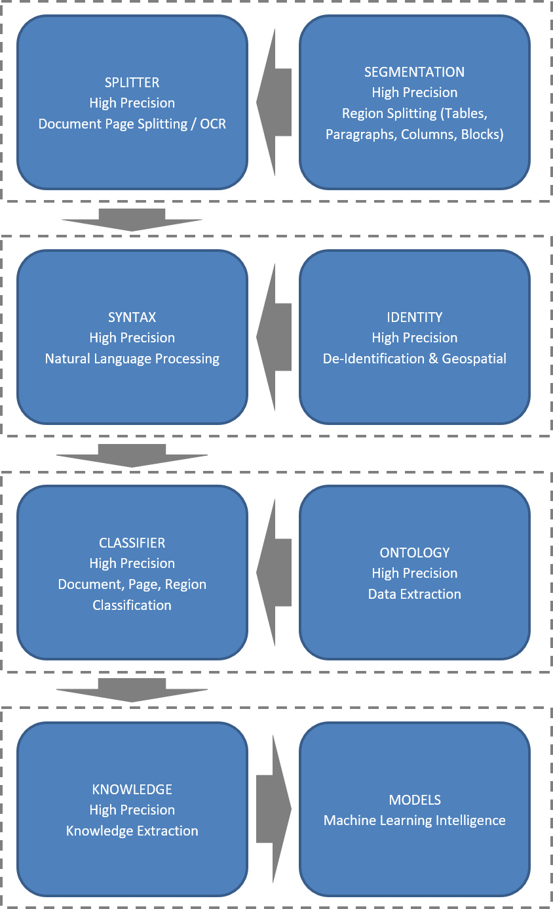

# Gap  
# Natural Language Processing for PDF/TIFF/Image Documents and Computer Vision for Images

## Framework
The Gap NLP/CV open source framework provides an easy to get started into the world of machine learning for your unstructured data in PDF documents, scanned documents, TIFF facsimiles,  camera captured documents, and computer vision for your image data.

+	Automatic OCR of scanned and camera captured images.  
+	Automatic Text Extraction from documents.  
+	Automatic Syntax Analysis.  
+	Programmatic control for data extraction or redaction (de-identification)  
    -	Names, Addresses, Proper Places  
    -	Social Security Numbers, Data of Birth, Gender  
    -	Telephone Numbers  
    -	Numerical Information (e.g., medical, financial, …) and units of measurement.  
    -	Unit conversion from US Standard to Metric, and vice-versa  
    -	Unicode character recognition  
+	Machine Training of Document and Page Classification.  
+	Automatic image preparation (resizing, sampling) and storage (HD5) for convolutional neural networks.

The framework consists of a sequence of Python modules which can be retrofitted into a variety of configurations. The framework is designed to fit seamlessly and scale with an accompanying infrastructure. To achieve this, the design incorporates:

+	Problem and Modular Decomposition utilizing Object Oriented Programming Principles.  
+	Isolation of Operations and Parallel Execution utilizing Functional Programming Principles.  
+	High Performance utilizing Performance Optimized Python Structures and Libraries.  
+	High Reliability and Accuracy using Test Driven Development Methodology.

The framework provides the following pipeline of modules to support your data and knowledge extraction from both digital and scanned PDF documents, TIFF facsimiles and image captured documents, and for preparing and storing image data for computer vision.

This framework is ideal for any organization planning to do data extraction from their repository of documents into an RDBMS system for CART analysis or generating word vectors for natural language deep learning (DeepNLP), and/or computer vision with convolutional neural networks (CNN).

## SPLITTER

The splitter module is the entry point into the pipeline. It consists of a `Document` and `Page` class. The `Document` class handles the splitting of PDF documents into PDF pages, TIFF facsimiles into TIFF pages, OCR and raw text extraction. PDF splitting and image extraction is handled by the open source Artifex’s Ghostscript ©, and TIFF splitting by open source Image Magic’s Magick ©. OCR is handled by the open source Google’s Tesseract ©. The Document object stores the individual PDF/TIFF/image pages and corresponding raw text and optionally page images (when scanned PDF, TIFF or images) in the specified storage path. The splitting process can be done synchronously or asynchronously, where in the latter case an event handler signals when the splitting/OCR has been completed and the page table is accessible.

For OCR, the resolution of the image extraction is settable, which will affect the quality of the OCR, and corresponding processing time. If the resolution of the original scanned page is lower than the setting, it will be up-sampled, and conversely if it is higher it will be down-sampled.

The Page class handles access to the individual pages, via the page table of the document class. Access is provided to the individual PDF, TIFF or image page, the scanned image (when scanned PDF, TIFF or images), raw text and the Natural Language Processing (NLP) processed tokens (when `SYNTAX` module is installed).

NLP processing of the raw text is deferred until first access (JIT), and then preserved in memory as long as the corresponding page object is referenced. The NLP processed tokens may be further segmented into regions, consisting of tables, paragraphs, columns, etc. when the `SEGMENTATION` module is installed.
The document and corresponding pages may be classified (i.e., category of the content) when the `CLASSIFICATION` module is installed.

## SYNTAX

The syntax module follows the splitter module in the pipeline. It consists of the Words and `Vocabulary` classes. The Words class handles natural language processing (NLP) of the extracted text. The NLP processing can be configured for tokenization, stemming, lemmatizing, stop word removal, syntax analysis and word classification, with Unicode support.

The word classifier recognizes:

+	Syntax Units: Articles, Demonstratives, Prepositions, Pronouns, Conjunctions, Quantifiers, Questions  
+	Abbreviations  
+	Acronyms  
+	Gender (inclusive of Transgender)  
+	Date of Birth  
+	USA and Canadian Addresses  
+	USA and Canadian Telephone Numbers  
+	USA Social Security numbers  
+	USA and ISO Standard for Dates  
+	USA and ISO Standard for Numbers and units of measure.  
+	Geographic Locations  
+	Sentiment

Dates, numbers and units of measure can be converted to either USA Standard or ISO Standard. USA and Canadian postal addresses are converted to the USPO standard for address matching.

Along with the builtin stemmer and lemmatizer, the module can optionally be configured to use the NLTK (open source) stemmers, lemmatizer and parts of speech annotations.

## VISION

The vision module provides preprocessing and storage of images into machine learning ready data. The module supports a wide variety of formats: JPG, PNG, BMP, and TIF, and number of channels (grayscale, RGB, RGBA).

Images can be processed incrementally, or in batches.  Preprocessing options include conversion to grayscale, resizing, normalizing and flattening. The machine ready image data is stored and retrievable from high performance HD5 file.

The HD5 storage provides fast and random access to the machine ready image data and corresponding labels.

Preprocessing can be done either synchronously or asynchronously, where in the latter case an event handler signals when the preprocessing has been completed and the machine ready datta is accessible.

Further disclosure requires an Non-Disclosure Agreement.
 
## MODULES

  

Proprietary and Confidential Information  
Copyright ©2018, Epipog, All Rights Reserved