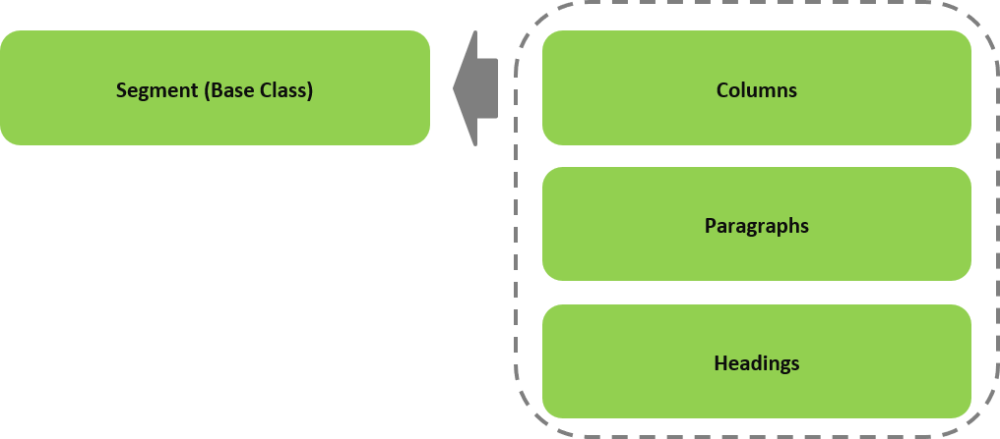

# <span style='color:saddlebrown'>Gap</span> Framework - Natural Language Processing for PDF/TIFF/Image Documents  

## SEGMENTATION MODULE
High Precision Document Segmentation  
Technical Specification, Gap v0.9.2

## 1 Segment
### 1.1 Segment Overview

The segment NLP preprocessor contains the following primary classes, and their relationships:

+ `Segment` - This is the base class for the representation of a Natural Language Processed text segmented into human perceived text layout, such as headings, paragraphs, table columns, etc. The constructor takes as a parameter a text to segment.

```python
segments = Segment(text)
```

  

Fig. 1a High Level view of `Segment` Class Object Relationships
 
### 1.2 Segment Initializer (Constructor)

**Synopsis**

```python
Segment(text=None)
```

**Parameters**

**text:** A Unicode text string.

**Usage**

When specified without parameters, an empty `Segments` object is created.

Otherwise, the text sequence is analyzed for region detection based on whitespace surrounding the text.

Regions include:

+	Headings
+	Paragraphs
+	Page Numbering

**Exceptions**

A `TypeError` is raised if the type of the parameter is not the expected type.

### 1.3 Segment Properties
#### 1.3.1 segments

**Synopsis**

```python
# Getter
segments = segment.segments			
```

**Usage**

When used as a getter the property returns `REWRITE IN PROGRESS`.

### 1.4 Segment Overridden Operators
#### 1.4.1 len()

**Synopsis**

```python
nsegments = len(segment)
```

**Usage**

The `len()` `(__len__)` operator is overridden to return the number of `Image` objects in the collection.

#### 1.4.1 []

**Synopsis**

```python
image = images[n] 
```

**Usage**

The `[]` `(__getitem__)` operator is overridden to return the segment at the specified index. 

**Exceptions**

A `IndexError` is raised if the index is out of range.

### 1.5 Segment Private Methods

The segment class contains the following private methods:

+ `_segmentation()` – This method is called by the constructor. It parses the text to identify text layouts, such as headings, paragraphs, columns, page numbering, etc, and separates the text into segments according to the identified layout.

### 1.6 Segment Public Methods

The `Segment` class contains of following public methods:

+ There are no public methods. 

---

### APPENDIX I: Updates

Pre-Gap (Epipog) v1.4  
+	An initial prototype was built

Gap v0.91 (alpha)  
+	Rewrite of Specification

### APPENDIX II: Anticipated Engineering

The following has been identified as enhancement/issues to be addressed in subsequent update:

1.  Add support for splitting dual column pages.

Proprietary Information  
Copyright ©2018, Epipog, All Rights Reserved